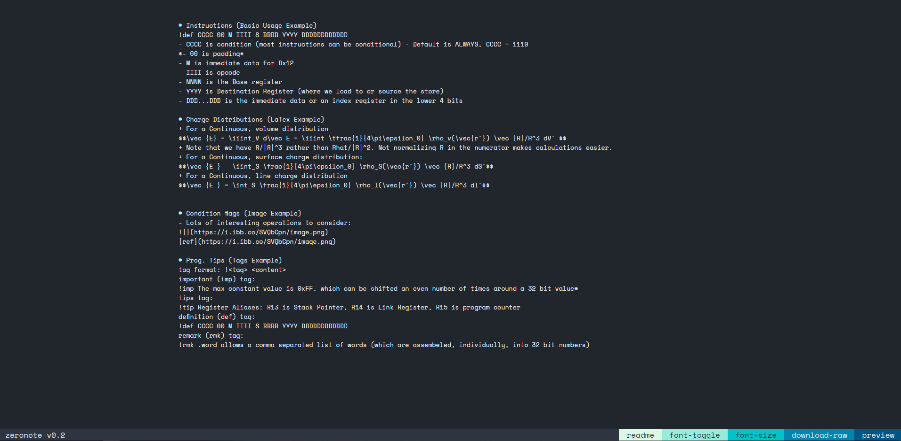
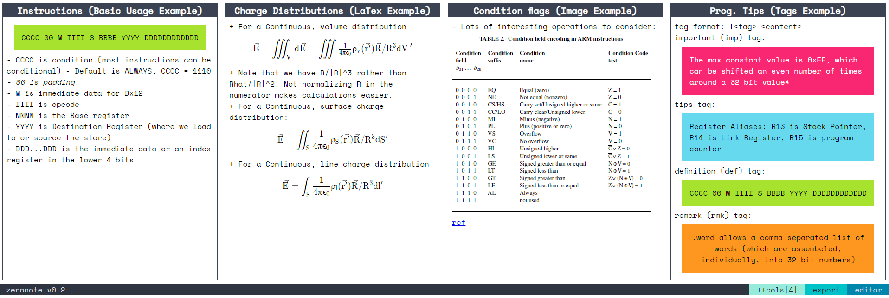

# Zeronote
Zeronote is a compact study sheet generator.

It uses a markdown-like syntax to create and fill note "boxes". The syntax is augmented with a few special features that are useful for study notes.

**WARNING: EXPORT BUTTON IS CURRENTLY BROKEN, I RECOMMEND USING A FULL PAGE SCREENSHOT EXTENSION TO GRAB THE FINAL RESULT**

## Features
- Headings
- Bold, Italicized formatting
- LaTex equation rendering
- Embedded links
- Embedded image from link
- !rmk, !imp, !def, !tip tags for orientation/highlighting
- Raw is downloadable as .txt
- Autogenerated layout with column control 
- Study Sheet Export to PNG
- Autosave to LocalStorage

## Usage

```md
# Instructions (Basic Usage Example)
!def CCCC 00 M IIII S BBBB YYYY DDDDDDDDDDDD
- CCCC is condition (most instructions can be conditional) - Default is ALWAYS, CCCC = 1110
*- 00 is padding*
- M is immediate data for Dx12
- IIII is opcode
- NNNN is the Base register
- YYYY is Destination Register (where we load to or source the store)
- DDD...DDD is the immediate data or an index register in the lower 4 bits

# Charge Distributions (LaTex Example)
+ For a Continuous, volume distribution
$$\vec {E} = \iiint_V d\vec E = \iiint \tfrac{1}{4\pi\epsilon_0} \rho_v(\vec{r'}) \vec {R}/R^3 dV' $$
+ Note that we have R/|R|^3 rather than Rhat/|R|^2. Not normalizing R in the numerator makes calculations easier.
+ For a Continuous, surface charge distribution:
$$\vec {E } = \iint_S \frac{1}{4\pi\epsilon_0} \rho_S(\vec{r'}) \vec {R}/R^3 dS'$$
+ For a Continuous, line charge distribution
$$\vec {E } = \int_S \frac{1}{4\pi\epsilon_0} \rho_l(\vec{r'}) \vec {R}/R^3 dl'$$


# Condition flags (Image Example)
- Lots of interesting operations to consider:

[ref](https://i.ibb.co/SVQbCpn/image.png)

# Prog. Tips (Tags Example)
tag format: !<tag> <content>
important (imp) tag:
!imp The max constant value is 0xFF, which can be shifted an even number of times around a 32 bit value*
tips tag:
!tip Register Aliases: R13 is Stack Pointer, R14 is Link Register, R15 is program counter
definition (def) tag:
!def CCCC 00 M IIII S BBBB YYYY DDDDDDDDDDDD
remark (rmk) tag:
!rmk .word allows a comma separated list of words (which are assembeled, individually, into 32 bit numbers)
```

### Screenshots

*Fig 1: Editor interface.*


*Fig 2: Viewer interface.*

### Exporting
**THIS IS CURRENTLY BROKEN, I RECOMMEND A FULL PAGE SCREENSHOT APP UNTIL I CAN FIX IT**
I'm still working on rendering to PDF, but:
- The export just opens the preview div in its own window
- Chrome's print option to set up:
  - Scaling to custom - something smaller if there's no clipping
  - Enable "Background Graphics" for coloured headers
  - Use paper size > letter


### Ideas for Improvement
* Highlighting (eg. colors for RMK, DEF)
* Intra-line bold, italic, equation processing using regex replace instead of match
* Collapsible Outliner
* Savable data URLs (eg. can export text data as URL, will be updated live)
* Image resizing
* Paste image into note